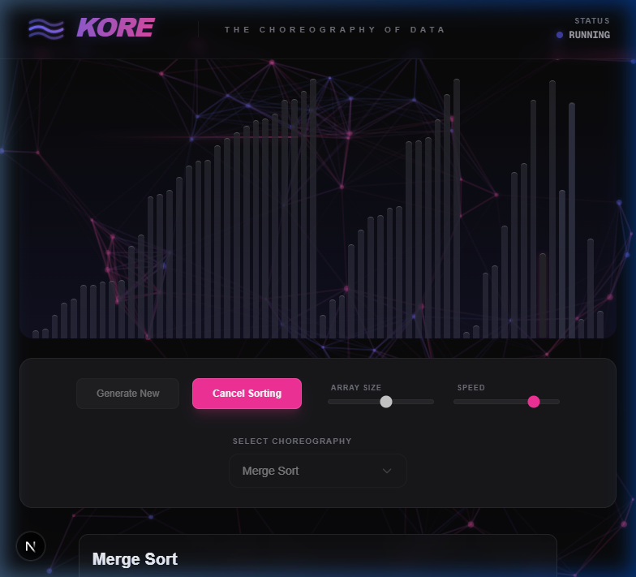

# 🌊 Kore: The Choreography of Data

**Kore** is a premium, highly interactive sorting algorithm visualizer built for the modern web. Inspired by the fluid motion of data, it transforms abstract logic into a vibrant "choreography" using a sleek **Cyber Neon** aesthetic.

**Live Demo**: [https://kore-omega.vercel.app/](https://kore-omega.vercel.app/)

## Final Project State


*A high-fidelity capture of "Merge Sort" in action against the interactive particle background.*

## ✨ Features

- **13 Sorting Algorithms**: From foundational sorts (Bubble, Selection) to efficient distribution and exotic methods (Radix, Shell, Bogo).
- **Interactive "Data Flow" Background**: A high-performance Canvas-based background with glowing particles, dynamic "Data Burst" streaks, and mouse repulsion.
- **Micro-Animations**: Rhythmic pulse animations synchronized across the UI and background.
- **Educational Insights**: Real-time complexity analysis and "Why?" explanations for every algorithm.
- **Premium Glassmorphism UI**: A consistent Indigo & Pink palette with backdrop-blur effects and custom animated components.
- **Zero-Ghost Animation Logic**: Optimized `useSorting` hook with synchronous state tracking for leak-proof, real-time speed adjustments.

## 🛠️ Tech Stack

- **Framework**: [Next.js (App Router)](https://nextjs.org/)
- **Logic**: React (Hooks, Refs, Context)
- **Styling**: Tailwind CSS (Vanilla CSS focus)
- **Visuals**: HTML5 Canvas API (Native Performance)
- **Language**: TypeScript

## 🚀 Getting Started

1. **Clone the repository**:

   ```bash
   git clone https://github.com/ztzrk/kore.git
   ```

2. **Install dependencies**:

   ```bash
   npm install
   ```

3. **Run the development server**:

   ```bash
   npm run dev
   ```

4. Open [http://localhost:3000](http://localhost:3000) with your browser to see the choreography.

## 📬 Connectivity

Want to request a new algorithm or discuss the "choreography of data"? Reach out:

- **LinkedIn**: [ztzrk](https://www.linkedin.com/in/ztzrk/)
- **GitHub**: [ztzrk](https://github.com/ztzrk)

---
*Built with passion in 2026.*
